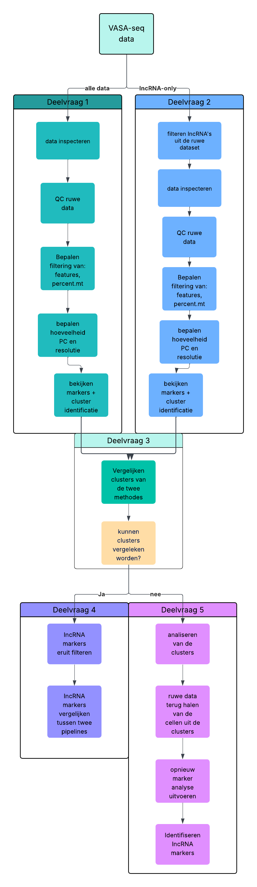

---
output:
  word_document: default
  pdf_document: default
  html_document: default
---
# LncRNA_sc_seq DLERPB

Bioinformatica project over lncRNA's uit scRNA-seq data van de embryogenese

------------------------------------------------------------------------

### Beschrijving project

Bij het project wordt er een pipeline gemaakt waarbij er gekeken wordt naar lncRNA's uit scRNA-seq data van de embryogenese. Er wordt gekeken of de lncRNA's uit de data gefilterd kunnen worden en of dit wellicht nieuwe markers kan geven. De data-analyse wordt gedaan door middel van Seurat in RStudio. Er is eerst een tutorial uitgevoerd om te oefenen met Seurat. Hierna is de data van het onderzoek waarbij ze kijken naar het totaal RNA met [VASAseq](#0), gebruikt om te kijken naar lncRNA's. Eerst is alle data door de Seurat-pipeline gehaald, hierna is er nog gekeken of de lncRNA's ook apart eruit gefilterd kunnen worden om specifieker te kijken of er nog nieuwe markers gevonden kunnen worden.

------------------------------------------------------------------------

### Project structuur

```         
.
├── README.md
├── .gitignore
├── afbeeldingen
│   ├── afbeelding_identificatie.jpg
│   ├── afbeelding_markers.jpg
│   └── workflow_schema.png
├── lncRNA_sc_splice.Rproj
├── raw_data
│   ├── filtered_gene_bc_matrices
│   │   └── hg19
│   └── pbmc3k_filtered_gene_bc_matrices.tar.gz
├── renv
│   ├── Hoe werk je met renv.md
│   ├── activate.R
│   ├── .gitignore
│   └── settings.json
├── renv.lock
└── seurat
    ├── Rmarkdown
    │   ├── Data_8_5_analyse.Rmd
    │   ├── Data_8_5_analyse_1_QC.Rmd
    │   ├── Data_8_5_analyse_2_PC_resolutie.Rmd
    │   ├── Data_8_5_analyse_3_cluster_identificatie.Rmd
    │   ├── Data_8_5_analyse_4_lncRNA_only.Rmd
    │   ├── Data_8_5_analyse_5_lncRNA_PC30_R1.Rmd
    │   ├── cluster identiteiten.xlsx
    │   └── seurat_tutorial.Rmd
    └── scripts
        ├── Lijstmaken_top_markers_clusters.R
        ├── downloaden_data_Seurat_tutorial.R
        └── marker_analyse_pc30_r1.R

```
------------------------------------------------------------------------

### Workflow

Als workflow wordt het volgende flowschema aangehouden: 



------------------------------------------------------------------------

### Onderzoeksvragen

Voor het onderzoek zijn de volgende onderzoeksvraag en deelvragen opgesteld:

Onderzoeksvraag: 

Kan een lncRNA-gerichte single-cell RNA-seq pipeline nieuwe, cell-type-specifieke markers identificeren tijdens de embryogenese?

Deelvraag 1:
Welke Seurat filteringparameters (min.features, percent.mt) zijn optimaal voor de gehele dataset en hoe beïnvloeden ze markeridentificatie? Welke markers komen tot expressie in de gehele dataset?

- Eerste stap is het inspecteren van de data, QC en bepalen filtering van percentage mt en features. Dit is verwerkt in de volgende Rmarkdown: /lncRNA_sc_seq/seurat/Rmarkdown/Data_8_5_analyse_1_QC.Rmd

- Tweede stap is het bepalen hoeveel PC's er meegenomen worden en wat de optimale resolutie is. Dit is verwerkt in de volgende Rmarkdown: /lncRNA_sc_seq/seurat/Rmarkdown/Data_8_5_analyse_2_PC_resolutie.Rmd 

- Laatste stap is het identificeren van de clusters. Dit is verwerkt in de volgende Rmarkdown: /lncRNA_sc_seq/seurat/Rmarkdown/Data_8_5_analyse_3_cluster_identificatie.Rmd

Deelvraag 2:
Welke Seurat‑filteringparameters (min.features, percent.mt, variable.features.n,) zijn optimaal voor de lncRNA-only workflow en hoe beïnvloeden ze markeridentificatie? Welke markers komen tot expressie in de lncRNA-only workflow?

- Het testen van een lncRNA-only pipeline wordt gedaan in de Rmarkdown: /lncRNA_sc_seq/seurat/Rmarkdown/Data_8_5_analyse_4_lncRNA_only.Rmd

Deelvraag 3: 
Kunnen de clusters van de lncRNA-only analyse vergeleken worden met de gehele dataset?

Deelvraag 4: 
Hoe overlappen markers uit de lncRNA-only analyse met markers uit de gehele dataset, en wat zegt dit over de toegevoegde waarde van een lncRNA-gerichte pipeline?

Deelvraag 5:
Is het mogelijk om lncRNA-celmarkers te identificeren door de ruwe data te onderzoeken nadat de cellen zijn geclusterd?

- Het analyseren van de lncRNA's uit de gecombineerde dataset wordt uitgevoerd in de Rmarkdown: /lncRNA_sc_seq/seurat/Data_8_5_analyse_5_lncRNA_PC30_R1.Rmd

------------------------------------------------------------------------

### Setup

Voor de dataverwerking zijn de volgende R-packages gebruikt:

-   `Seurat`

-   `dplyr`

-   `patchwork`

-   `data.table`

-   `ggplot2`

-   `here`

-   `ggraph`

-   `clustree`

-   `writexl`

-   `readxl`

-   `knitr`

------------------------------------------------------------------------

### Data

#### Seurat tutorial

Om te oefenen met Seurat is een tutorial uitgevoerd met testdata. De data voor de Seurat [tutorial](https://satijalab.org/seurat/articles/pbmc3k_tutorial) is gedownload van de Seurat website.

Er is een script geschreven voor het downloaden van de data. Deze is te vinden onder `/lncRNA_sc_splice/seurat/scripts/downloaden_data_Seurat_tutorial`

Omdat de bestanden voor de tutorial niet al te groot zijn, zijn ze ook geplaatst onder `/lncRNA_sc_splice/raw_data`. In de Rmarkdown wordt hier ook naar verwezen met de `here` functie.

#### VASAseq

De data uit het onderzoek is al gedownload op de server. Dit is te vinden onder het volgende pad: `/home/data/projecticum/splicing/data/`. Omdat het om zeer grote bestanden gaat is er voor gekozen om de data niet nog in het eigen project te zetten. Dit zou onnodig veel ruimte in beslag nemen. In de Rmarkdown is dus ook verwezen naar het bovenstaande pad.

De ruwe data van het onderzoek is te vinden bij de GEO website onder het volgende nummer: [GSE176588](https://www.ncbi.nlm.nih.gov/geo/query/acc.cgi?acc=GSE176588).

#### Renv werkomgeving

Voor het project wordt er gebruik gemaakt van renv voor het reproduceerbaar maken van het project. De werkinstructies en uitleg staat beschreven bij: `/lncRNA_sc_seq/renv/Hoe werk je met renv.md`.

------------------------------------------------------------------------

### Auteur

Noa van Dam

Email: Noa\@damvan.nl

------------------------------------------------------------------------
